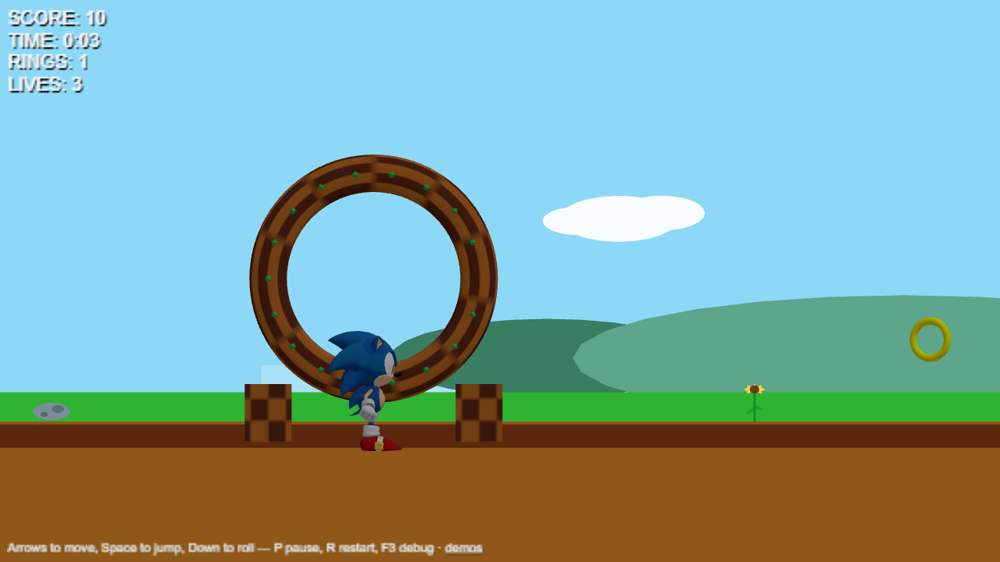
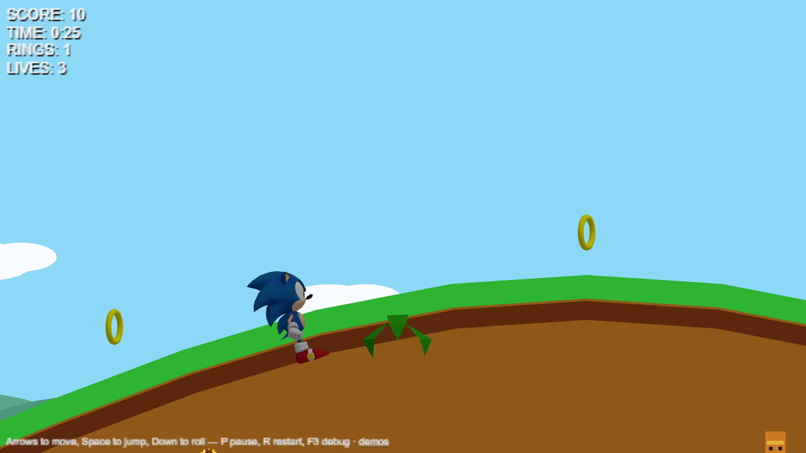

# sonic-three-js

A 2.5D classic Sonic game engine built on [Three.js](https://threejs.org/) and TypeScript.
Data-driven levels, classic Sonic movement physics — slopes, ramps, springs and full
360° loop-de-loops — plus rings, badniks, item monitors, checkpoints and lives.




## Quickstart

```bash
npm install
npm run dev        # opens the demo menu at http://localhost:5173
```

| Command | Description |
| --- | --- |
| `npm run dev` | Vite dev server with the demo pages |
| `npm test` | Vitest suite (unit + gameplay + asset regression tests) |
| `npm run typecheck` | TypeScript check across src, tests and examples |
| `npm run build` | Compile the library to `dist/` |

### Demos

- **Green Hill — Act 1** (`examples/green-hill.html`): the full game — hills, a ramp
  jump over a death pit, a loop-de-loop, springs, badniks, monitors, checkpoints and a
  goal sign with a results screen.
- **Physics Sandbox** (`examples/physics-sandbox.html`): a slope ladder (15°–60°),
  half-pipe, big loop, spring row and platform steps, with the debug overlay enabled.

Both demos accept URL flags: `?debug=1` starts with the debug overlay, and `?x=&y=`
spawns the player somewhere else (handy for inspecting a level area).

### Controls

| Input | Action |
| --- | --- |
| Arrow keys | Move |
| Space | Jump (release early for a shorter jump) |
| Down | Roll (keep momentum downhill) |
| P / Esc | Pause |
| R | Restart |
| F3 | Debug overlay (FPS, player state, hitboxes) |

## Library overview

Everything is exported from the package root:

```ts
import {
  Stage, HUD, LevelLoader, greenHillAct1,
} from 'sonic-threejs-engine';

const stage = new Stage('game-container');
const hud = new HUD('game-container');
const loader = new LevelLoader({
  onProgress: (loaded, total) => console.log(`loading ${loaded}/${total}`),
});

const { player } = await loader.load(stage, greenHillAct1);
stage.engine.onUpdate(() => hud.update(player));
stage.start();
```

### Core

- **`Engine`** — game loop with a fixed 1/60s timestep, entity management, brute-force
  AABB collision between collidable entities, garbage collection of destroyed entities,
  `onUpdate(frame)` hooks and a typed event emitter
  (`entityAdded`, `entityDestroyed`, `ringCollected`, `playerHurt`, `playerDied`,
  `playerRespawned`, `gameOver`, `checkpointReached`, `stageCleared`, …).
- **`Terrain` / `TerrainPath`** — the collision world. Surfaces are 2D polylines
  (open for floors/hills/ramps, closed or self-overlapping for loops) indexed by
  x-buckets, with walkable-side raycasts and solid-box side walls. Built from level
  data by the `LevelLoader`.
- **`Physics`** — gravity and velocity helpers over a typed `PhysicsBody` interface.
- **`Input`** — keyboard state with edge detection (`justPressed`) and stuck-key
  handling; `Renderer` — orthographic side-scroller camera setup and disposal.

### Player physics

The `Player` implements classic Sonic movement: `groundSpeed` along the surface with
slope factors (running and rolling), slipping/falling off steep walls when too slow,
ramp launches at surface ends, jumps along the surface normal, variable jump height,
dual-sensor landing that recovers the orientation in air, and the full hurt/death
flow — ring-loss scatter, invulnerability frames, shield, invincibility, lives and
respawn at checkpoints. All constants are public and tunable.

### Entities

`Ring` (collectibles and scattered physics rings), `Badnik` (Motobug-style patrol
enemy), `Monitor` (rings / shield / invincibility), `Spring` (up and diagonal),
`Checkpoint` (respawn point), `FinishSign` (emits `stageCleared`), and
`SceneryElement` for decorations.

### Levels

Levels are plain data (`LevelDefinition`): camera, theme colors/materials, background
bands, terrain (solid platforms or walkable paths with slopes and loops), gameplay
entities and decorations (GLB models or procedural runtime art). See
`src/levels/greenHillAct1.ts` and `src/levels/physicsPlayground.ts` for complete
examples.

A terrain "loop carrier" is a path that overlaps itself once: the player enters the
loop, is carried up and around exactly once, and continues along the exit — render a
flat visual twin path (`visualOnly: true`) under it and mark the carrier
`collisionOnly: true`.

### Components

DOM-based UI helpers: `HUD` (score/time/rings/lives with pause-aware timer),
`LoadingScreen` (progress bar), `ResultsOverlay` (stage clear / game over panels) and
`DebugOverlay` (FPS, player physics state, hitbox wireframes).

## Project structure

```
src/
  core/        Engine, Physics, Renderer, Input, Terrain, events
  entities/    Player, Ring, Badnik, Monitor, Spring, Checkpoint, FinishSign, Stage, SceneryElement
  level/       LevelDefinition types, LevelLoader, Green Hill runtime art
  levels/      greenHillAct1, physicsPlayground
  components/  HUD, LoadingScreen, ResultsOverlay, DebugOverlay
examples/      demo menu + game pages (shared bootstrap in demo.ts)
assets/models/ GLB models with per-asset provenance metadata (see assets/models/README.md)
scripts/       Sketchfab download + asset generation tooling
tests/         Vitest suites (physics, terrain, gameplay, loader, engine, assets)
```

## Assets

Models come with source/license metadata in `assets/models/metadata.json` files — see
[assets/models/README.md](assets/models/README.md) for the download and generation
pipeline (Sketchfab tooling, Blender-generated Green Hill environment, unit
measurement).

## Notes

- This is a fan project for educational purposes. Sonic the Hedgehog is a trademark of
  SEGA; assets keep their original licenses (documented per asset).
